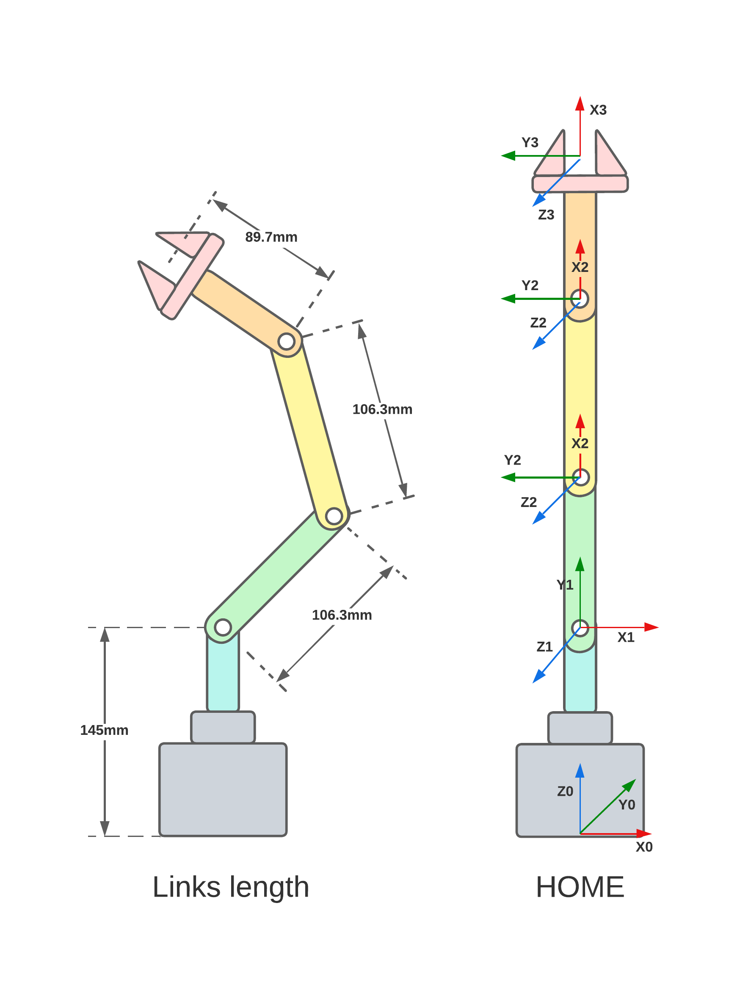

# Lab 2 Robotics: Forward Kinematics with Phantom X

This repository contains both MATLAB and python scripts to interact with the Phantom X robot in order to change its position. This is done by changing the configuration space of each one of its joints through the communication with different services and topics in ROS.

## Authors

* Maria Alejandra Arias Frontanilla
* Camilo Andres Vera Ruiz

## Measuring the Phantom X

The first thing that was carried out before beginning to play with the joint values of the Phantom X was to measure the length of the links using a caliber.

According to the measurements taken, the lenghts of each link is:

* Link 1: 14.5 cm
* Link 2: 10.63 cm
* Link 3: 10.65 cm
* Link 4: 8.97 cm

Having the length of the links we can now obtain the Denavit - Hartenberg parameters using the following diagram.



### Denavit - Hartemberg parameters of Phantom X

Below we can see the corresponding Denavit - Hartemberg parameters when j is the index of each link.


## Phantom X in Matlab

In order to see a representation of the Phantom X, we can create a Serial Link using the Denavit - Hartemberg parameters. As we can see all joints are revolute.

```Matlab
l = [14.5, 10.63, 10.65, 89.7]; %length of links

L(1) = Link('revolute','alpha',pi/2,'a',0,   'd',l(1),'offset',0,   'qlim',[-3*pi/4 3*pi/4]);
L(2) = Link('revolute','alpha',0,   'a',l(2),'d',0,   'offset',pi/2,'qlim',[-3*pi/4 3*pi/4]);
L(3) = Link('revolute','alpha',0,   'a',l(3),'d',0,   'offset',0,   'qlim',[-3*pi/4 3*pi/4]);
L(4) = Link('revolute','alpha',0,   'a',0,   'd',0,   'offset',0,   'qlim',[-3*pi/4 3*pi/4]);
PhantomX = SerialLink(L,'name','Px');
```

### Setting the Phantom X tool

One of the most used conventions when representing a tool is the famous NOA (normal, open, approach). And yes, this is the convention that we will use to set the frame of our tool. To do this we will use the property *tool* of *SerialLink*. 

```Matlab
%Tool orientation following NAO Convention
PhantomX.tool = [0 0 1 l(4); -1 0 0 0; 0 -1 0 0; 0 0 0 1];
```

### Plotting Phantom X

Now comes the moment of truth... If we did everything right, we should see now a representation of our Phantom X in its home position with the tool frame following NOA Convention

```Matlab
%Plot PhantomX
PhantomX.plot([0 0 0 0], 'notiles', 'noname');
hold on
trplot(eye(4),'rgb','arrow','length',15,'frame','0')
ws = [-50 50];
axis([repmat(ws,1,2) 0 60])
PhantomX.teach()

```


Yes! It worked :D

But wait... That's not all. Do you remember the title of this lab? Right... Forward Kinematics. The main idea is now to be able to determine the position of our tool in function of the configuration of each one of the joints. That's exactly what we will do next.

### Forward Kinematics. From base to tool

To know the position and orientation of our tool from the base we can calculate the homogeneous transformation matrix. This is done by multiplicating each one of the transformation matrices of the frames from the base to the tool.

```Matlab
%% MTHs PhantomX
syms q1 q2 q3 q4 as real
%MTHs
T1_0 = L(1).A(q1);
%Sim
T1_0(1,2) = 0;
T1_0(2,2) = 0;
T1_0(3,3) = 0;
T2_1 = L(2).A(q2)
T3_2 = L(3).A(q3) 
T4_3 = L(4).A(q4)
%% MTH From base to TCP
MTH_TCP_base = simplify(T1_0*T2_1*T3_2*T4_3*PhantomX.tool)

```
And here it is. Our long MTH of the tool:


As you can imagine *q1, q2, q3, q4* are the variables corresponding to the values of each joint. In home position all of them take the value of 0. 

### Different configurations of Phantom X

Since the variables q can take different values, we can get different positions of our Phantom X. Below we see the code and respective image for three different configurations.

```Matlab
% First configuration
qt1 = deg2rad([0 90 -30 90]);
PhantomX.plot(qt1, 'notiles', 'noname');

```


```Matlab
%% Second configuration
qt2 = deg2rad([0 -60 30 45]);
PhantomX.plot(qt2, 'notiles', 'noname');

```


```Matlab
%% Third configuration
qt3 = deg2rad([85 -45 0 -30]);
PhantomX.plot(qt3, 'notiles', 'noname');

```


Ok... Interesting and even cool but we haven't really done anything with ROS, right? Yes, we haven't. But we are about to do it...

## Phantom X in Matlab with ROS

### Topic subscription

Ok! Finally we will begin with ROS. But let's begin soft and smootly and let's something: subscribe to a topic. The topic that we will use belongs to the *Dynamixel Workbench* and its name is *joint_states*. Let's see if you can guess what it does... Right! It returns the value of each joint. Below you can find the code to receive the message of this topic

```Matlab
%% Topic subscription

jointSub = rossubscriber('/dynamixel_workbench/joint_states', 'DataFormat','struct'); % We create the subscriptor
[msgSub,status,statustext] = receive(jointSub,10); % We receive the message

disp("Angle in radians for each joint:")
disp(" ")

for i = 1:5
    disp("Joint" + i + ": " + msgSub.Position(i))
end
```

## Moving the joints of Phantom X with ROS, Dynamixel and Matlab, live and direct

Ok... so far we have been able to receive information from a topic. What if we could now call a service and send information to it and by doing that being able to move our Phantom X and at the same time see how it should look like using a plot in Matlab all live and direct? Well... Sounds a little bit more interesting. Let's try it!

To do that we will need to call a service called *dynamixel_command*. This service has a message that receives three parameters:

* *Addr.Name*: It can be *Goal_Position* if we want to change the value of the joint position or *Torque_Limit* if we want to change the torque limit of the joint
* *Id*: Each joint has a corresponing ID
* *Value*: The value that will be sent to the Addr.Name selected

Due to that we needed to call the same service to change the values of each joint we created a function called *moveRobot* to do it. This function receives the configuration *q* for all the joints. Below you can find the code. In the first part, we create the client of the service and the service message. After this, we send different values of torque followed by different values of position to each joint.

```Matlab
%Function to move joints and gripper
function output = moveRobot(q)
    offsetID = 0;
    motorSvcClient = rossvcclient('/dynamixel_workbench/dynamixel_command'); %Creation of client for the service
    motorCommandMsg = rosmessage(motorSvcClient); %Creation of the service message
    

    %Torque adjustment
    motorCommandMsg.AddrName = "Torque_Limit";
    torque = [600, 400, 400, 400, 400];
    for i= 1: length(q) 
        motorCommandMsg.Id = i+offsetID;
        motorCommandMsg.Value = torque(i);
        call(motorSvcClient,motorCommandMsg);
    end

    %Movement of joints    
    motorCommandMsg.AddrName = "Goal_Position";
    for i= 1: length(q) %To move joints
        disp(i)
        motorCommandMsg.Id = i+offsetID;
        disp(round(mapfun(rad2deg(q(i)),-150,150,0,1023)))
        motorCommandMsg.Value = round(mapfun(rad2deg(q(i)),-150,150,0,1023));
        call(motorSvcClient,motorCommandMsg); 
        pause(1);
    end
    
end
```

When sending the values of position, we had to remap them. In Dynamixel we have values between 0 and 1023 which correspond to -150 degrees and 150 degrees, respectively.

Having the function the only thing that was missing was to call it and see if it worked. We did it with different configurations as shown below.

``` Matlab
%% Different configurations in Matlab with ROS and Dynamixel

q1 = [deg2rad([90 0 0 0]) 0];
q2 = [deg2rad([-20 20 -20 20]) 0];
q3 = [deg2rad([30 -30 30 -30]) 0];
q4 = [deg2rad([-90 15 -55 17]) 0];
q5 = [deg2rad([-90 45 -55 45]) 0];
```

Then we called the function *moveRobot* and plotted the same configuration in Matlab using our previously created Serial Link PhantomX. And guess what?... it worked! :D

``` Matlab
%% With q1
PhantomX.plot(q1(1:4), 'notiles', 'noname');
moveRobot(q1)
```

And just in case you don't believe that it actually works, then... watch this [video](https://www.youtube.com/watch?v=pTf6VG7GkH4) and see it for yourself :D. .

## Phantom X in Python

In order to control the robot from python, a short script is developed so there is possible to use the keyboard to control the movement of each joint and the gripper.

At first we need a function to obtain the read of a key press event, in this case the same function used in the past lab is used here, you can see it below.

```python
def getkey(): 

    """
    Get the last pressed key
    """

    fd = sys.stdin.fileno()
    old = termios.tcgetattr(fd)
    new = termios.tcgetattr(fd)
    new[3] = new[3] & ~TERMIOS.ICANON & ~TERMIOS.ECHO
    new[6][TERMIOS.VMIN] = 1
    new[6][TERMIOS.VTIME] = 0
    termios.tcsetattr(fd, TERMIOS.TCSANOW, new)
    c = None
    try:
        c = os.read(fd, 1)
    finally:
        termios.tcsetattr(fd, TERMIOS.TCSAFLUSH, old)
    c = str(c).replace('b', "").replace('\'', "")
    return c
```

A function to update the joint position by a ros service request is needed too, we use the function provided by the lab guide, that allow us to modify position or torque of any of the motors connected.

```python
def jointCommand(command, id_num, addr_name, value, time):
    
    """
    Make a request to a the "dynamixel_command" ros service to modify a  
    parameter such as position or torque of the motor specified by the "id_num" 
    parameter.
    """
    rospy.wait_for_service('dynamixel_workbench/dynamixel_command')
    try:        
        dynamixel_command = rospy.ServiceProxy('/dynamixel_workbench/dynamixel_command', DynamixelCommand)
        result = dynamixel_command(command,id_num,addr_name,value)
        rospy.sleep(time)
        return result.comm_result
    except rospy.ServiceException as exc:
        print(str(exc))
```

The function shown below is used to convert position values from degrees to a number from 0 to 1023, because the dynamixel servo motor uses a 10 bits value to control the position.

```python
def deg2raw(input_list: list = [0,0,0,0,0], min_deg: int = -150, max_deg: int = 150)->list:
    """
    Map a list of motor positions in degrees to a 10 bit values from 0 to 1023. 
    """
    out_list = [0,0,0,0,0]
    for i in range(len(input_list)):
        out_list[i] = int( ((input_list[i] - min_deg)*1024)/(max_deg-min_deg) )
    return out_list
```

The main function take two parameters, `goal position` and `home position` both are a list of positions of each joint in degrees. This code implements a menu by a state machine aproach, each state correspond to a specific joint, by pressing `w` or `s` is posible to change the state to control another joint, and by pressing `a` or `d` is posible to change the position of the joint either to home_postion or goal_postion respectively. the code to do that is showed bellow

```python
def main(goal_position: list = [30,45,-30,-60,150], home_position: list = [0,0,0,0,0]):
    
    motors_ids = [6,7,8,9,10]

    goal_position_raw = deg2raw(goal_position)
    home_position_raw = deg2raw(home_position)

    # Torque joints config
    jointCommand('', motors_ids[0], 'Torque_Limit', 600, 0)
    jointCommand('', motors_ids[1], 'Torque_Limit', 400, 0)
    jointCommand('', motors_ids[2], 'Torque_Limit', 400, 0)
    jointCommand('', motors_ids[3], 'Torque_Limit', 400, 0)
    jointCommand('', motors_ids[4], 'Torque_Limit', 400, 0)

    # Initial state
    selected_link = "waist"
    print("--------------------------------")
    print("link: ",selected_link)

    # State machine
    while(True):
        # Key pressed event
        key = getkey()
        
        if(selected_link == "waist"):
            if(key == "w"):
                selected_link = "shoulder"
                print("--------------------------------")
                print("link: ",selected_link)
            elif(key == "s"):
                print("--------------------------------")
                selected_link = "gripper"
                print("link: ",selected_link)
            elif(key == "d"):
                print("movement to goal ...")
                jointCommand('', motors_ids[0], 'Goal_Position', goal_position_raw[0], 0.5)
            elif(key == "a"):
                print("movement to home ...")
                jointCommand('', motors_ids[0], 'Goal_Position', home_position_raw[0], 0.5)
                
        elif(selected_link == "shoulder"):
            if(key == "w"):
                selected_link = "elbow"
                print("--------------------------------")
                print("link: ",selected_link)
            elif(key == "s"):
                print("--------------------------------")
                selected_link = "waist"
                print("link: ",selected_link)
            elif(key == "d"):
                print("movement to goal ...")
                jointCommand('', motors_ids[1], 'Goal_Position', goal_position_raw[1], 0.5)
            elif(key == "a"):
                print("movement to home ...")
                jointCommand('', motors_ids[1], 'Goal_Position', home_position_raw[1], 0.5)

        elif(selected_link == "elbow"):
            if(key == "w"):
                selected_link = "wrist"
                print("--------------------------------")
                print("link: ",selected_link)
            elif(key == "s"):
                print("--------------------------------")
                selected_link = "shoulder"
                print("link: ",selected_link)
            elif(key == "d"):
                print("movement to goal ...")
                jointCommand('', motors_ids[2], 'Goal_Position', goal_position_raw[2], 0.5)
            elif(key == "a"):
                print("movement to home ...")
                jointCommand('', motors_ids[2], 'Goal_Position', home_position_raw[2], 0.5)

        elif(selected_link == "wrist"):
            if(key == "w"):
                selected_link = "gripper"
                print("--------------------------------")
                print("link: ",selected_link)
            elif(key == "s"):
                print("--------------------------------")
                selected_link = "elbow"
                print("link: ",selected_link)
            elif(key == "d"):
                print("movement to goal ...")
                jointCommand('', motors_ids[3], 'Goal_Position', goal_position_raw[3], 0.5)
            elif(key == "a"):
                print("movement to home ...")
                jointCommand('', motors_ids[3], 'Goal_Position', home_position_raw[3], 0.5)


        elif(selected_link == "gripper"):
            if(key == "w"):
                selected_link = "waist"
                print("--------------------------------")
                print("link: ",selected_link)
            elif(key == "s"):
                print("--------------------------------")
                selected_link = "wrist"
                print("link: ",selected_link)
            elif(key == "d"):
                print("movement to goal ...")
                jointCommand('', motors_ids[4], 'Goal_Position', goal_position_raw[4], 0.5)
            elif(key == "a"):
                print("movement to home ...")
                jointCommand('', motors_ids[4], 'Goal_Position', home_position_raw[4], 0.5)

```

The full implementation can be found [here](script.py) and you can see the script controling both physical PhatomX and RViz simulation in this [video](https://www.youtube.com/watch?v=thgsJ-mzMTc).

## Conclusions

There are multiple ways in which we can communicate using ROS. We can do it by subscribing or publishing to topics or by calling services. In the same way, there are different ways that can help us to achieve the same behaviour. We can use for example Python or Matlab. Our task is to determine which one of them works better for the goal that we have in mind.  
